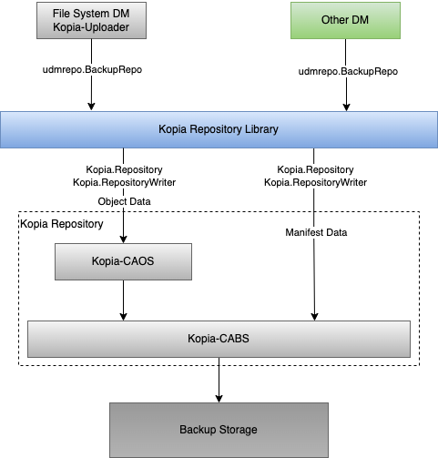
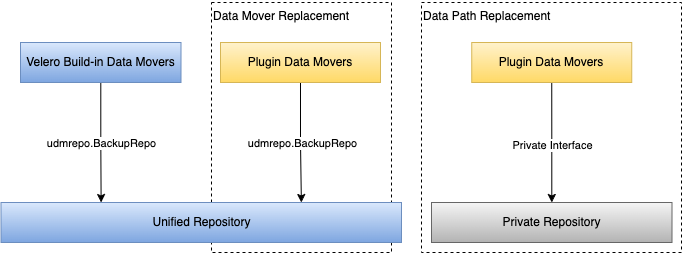
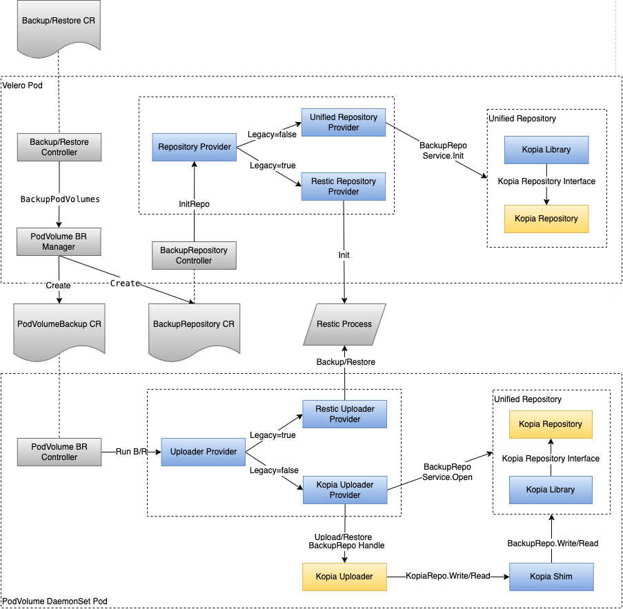
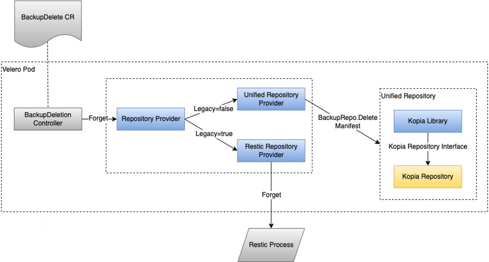
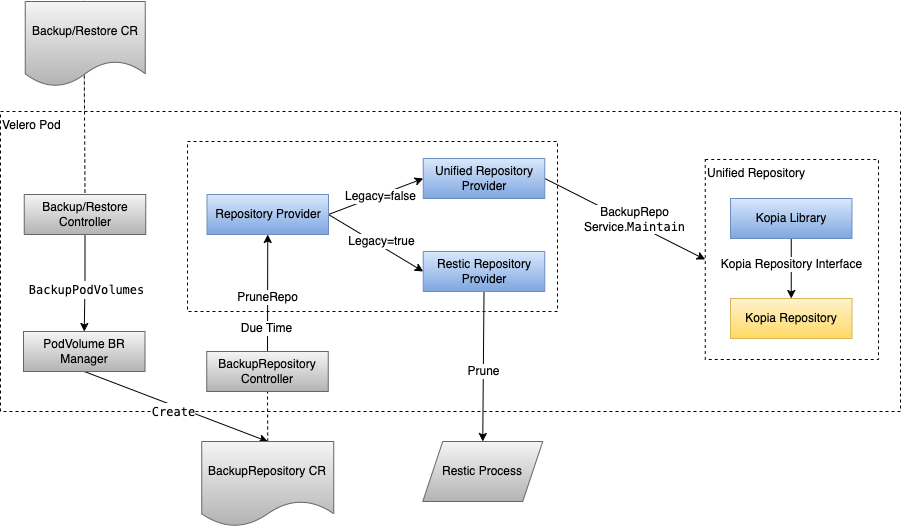
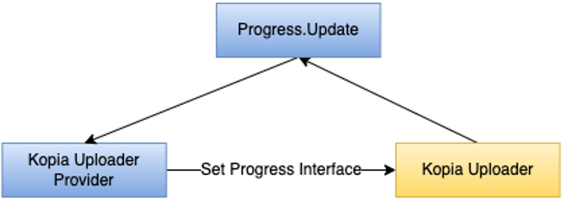
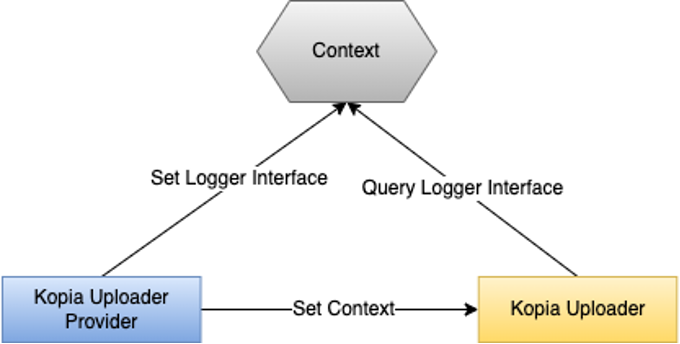
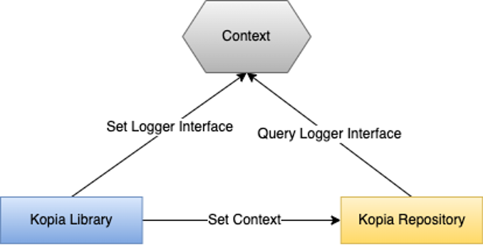

# Unified Repository & Kopia Integration Design

## Glossary & Abbreviation

**BR**: Backup & Restore  
**Backup Storage**: The storage that meets BR requirements, for example, scalable, durable, cost-effective, etc., therefore, Backup Storage is usually implemented as Object storage or File System storage, it may be on-premise or in cloud. Backup Storage is not BR specific necessarily, so it usually doesn’t provide most of the BR related features. On the other hand, storage vendors may provide BR specific storages that include some BR features like deduplication, compression, encryption, etc. For a standalone BR solution (i.e. Velero), the Backup Storage is not part of the solution, it is provided by users, so the BR solution should not assume the BR related features are always available from the Backup Storage.  
**Backup Repository**: Backup repository is layered between BR data movers and Backup Storage to provide BR related features. Backup Repository is a part of BR solution, so generally, BR solution by default leverages the Backup Repository to provide the features because Backup Repository is always available; when Backup Storage provides duplicated features, and the latter is more beneficial (i.e., performance is better), BR solution should have the ability to opt to use the Backup Storage’s implementation.  
**Data Mover**: The BR module to read/write data from/to workloads, the aim is to eliminate the differences of workloads.  
**TCO**: Total Cost of Ownership. This is a general criteria for products/solutions, but also means a lot for BR solutions. For example, this means what kind of backup storage (and its cost) it requires, the retention policy of backup copies, the ways to remove backup data redundancy, etc.   
**RTO**: Recovery Time Objective. This is the duration of time that users’ business can recover after a disaster.  

## Background

As a Kubernetes BR solution, Velero is pursuing the capability to back up data from the volatile and limited production environment into the durable, heterogeneous and scalable backup storage. This relies on two parts:  

- Move data from various production workloads. The data mover has this role. Depending on the type of workload, Velero needs different data movers. For example, file system data mover, block data mover, and data movers for specific applications. At present, Velero supports moving file system data from PVs through Restic, which plays the role of the File System Data Mover.  
- Persist data in backup storage. For a BR solution, this is the responsibility of the backup repository. Specifically, the backup repository is required to:  
  - Efficiently save data so as to reduce TCO. For example, deduplicate and compress the data before saving it
  - Securely save data so as to meet security criteria. For example, encrypt the data on rest, make the data immutable after backup, and detect/protect from ransomware
  - Efficiently retrieve data during restore so as to meet RTO. For example, restore a small unit of data or data associated with a small span of time 
  - Effectively manage data from all kinds of data movers in all kinds of backup storage. This means 2 things: first, apparently, backup storages are different from each other; second, some data movers may save quite different data from others, for example, some data movers save a portion of the logical object for each backup and need to visit and manage the portions as an entire logic object, aka. incremental backup. The backup repository needs to provide unified functionalities to eliminate the differences from the both ends
  - Provide scalabilities so that users could assign resources (CPU, memory, network, etc.) in a flexible way to the backup repository since backup repository contains resource consuming modules

At present, Velero provides some of these capabilities by leveraging Restic (e.g., deduplication and  encryption on rest). This means that in addition to being a data mover for file system level data, Restic also plays the role of a backup repository, albeit one that is incomplete and limited:  

- Restic is an inseparable unit made up of a file system data mover and a repository. This means that the repository capabilities are only available for Restic file system backup. We cannot provide the same capabilities to other data movers using Restic.
- The backup storage Velero supports through our Restic backup path depends on the storage Restic supports. As a result, if there is a requirement to introduce backup storage that Restic doesn’t support, we have no way to make it.
- There is no way to enhance or extend the repository capabilities, because of the same reason – Restic is an inseparable unit, we cannot insert one or more customized layers to make the enhancements and extensions.

Moreover, as reflected by user-reported issues, Restic seems to have many performance issues on both the file system data mover side and the repository side.  

On the other hand, based on a previous analysis and testing, we found that Kopia has better performance, with more features and more suitable to fulfill Velero’s repository targets (Kopia’s architecture divides modules more clearly according to their responsibilities, every module plays a complete role with clear interfaces. This makes it easier to take individual modules to Velero without losing critical functionalities).  

## Goals

- Define a Unified Repository Interface that various data movers could interact with. This is for below purposes:
  - All kinds of data movers acquire the same set of backup repository capabilities very easily
  - Provide the possibility to plugin in different backup repositories/backup storages without affecting the upper layers
  - Provide the possibility to plugin in modules between data mover and backup repository, so as to extend the repository capabilities
  - Provide the possibility to scale the backup repository without affecting the upper layers
- Use Kopia repository to implement the Unified Repository
- Use Kopia uploader as the file system data mover for Pod Volume Backup
- Have Kopia uploader calling the Unified Repository Interface and save/retrieve data to/from the Unified Repository
- Make Kopia uploader generic enough to move any file system data so that other data movement cases could use it
- Use the existing logic or add new logic to manage the unified repository and Kopia uploader
- Preserve the legacy Restic path, this is for the consideration of backward compatibility

## Non-Goals

- The Unified Repository supports all kinds of data movers to save logic objects into it. How these logic objects are organized for a specific data mover (for example, how a volume’s block data is organized and represented by a unified repository object) should be included in the related data mover design.
- At present, Velero saves Kubernetes resources, backup metedata, debug logs separately. Eventually, we want to save them in the Unified Repository. How to organize these data into the Unified Repository should be included in a separate design.
- For PodVolume BR, this design focuses on the data path only, other parts beyond the data read/write and data persistency are irrelevant and kept unchanged. 
- Kopia uploader is made generic enough to move any file system data. How it is integrated in other cases, is irrelevant to this design. Take CSI snapshot backup for example, how the snapshot is taken and exposed to Kopia uploader should be included in the related data mover design.
- The adanced modes of the Unified Repository, for example, backup repository/storage plugin, backup repository extension, etc. are not included in this design. We will have separate designs to cover them whenever necessary.

## Architecture of Unified Repository

Below shows the primary modules and their responsibilities:

- Kopia uploader, as been well isolated, could move all file system data either from the production PV (as Velero’s PodVolume BR does), or from any kind of snapshot (i.e., CSI snapshot).
- Unified Repository Interface, data movers call the Unified Repository Interface to write/read data to/from the Unified Repository.
- Kopia repository layers, CAOS and CABS, work as the backup repository and expose the Kopia Repository interface.
- A Kopia Repository Library works as an adapter between Unified Repository Interface and Kopia Repository interface. Specifically, it implements Unified Repository Interface and calls Kopia Repository interface.
- At present, there is only one kind of backup repository -- Kopia Repository. If a new backup repository/storage is required, we need to create a new Library as an adapter to the Unified Repository Interface
- At present, the Kopia Repository works as a single piece in the same process of the caller, in future, we may run its CABS into a dedicated process or node.
- At present, we don’t have a requirement to extend the backup repository, if needed, an extra module could be added as an upper layer into the Unified Repository without changing the data movers.  

Neither Kopia uploader nor Kopia Repository is invoked through CLI, instead, they are invoked through code interfaces, because we need to do lots of customizations.  

The Unified Repository takes two kinds of data:
- Unified Repository Object: This is the user's logical data, for example, files/directories, blocks of a volume, data of a database, etc.
- Unified Repository Manifest: This could include all other data to maintain the object data, for example, snapshot information, etc.  

For Unified Repository Object/Manifest, a brief guidance to data movers are as below:
- Data movers treat the simple unit of data they recognize as an Object. For example, file system data movers treat a file or a directory as an Object; block data movers treat a volume as an Object. However, it is unnecessary that every data mover has a unique data format in the Unified Repository, to the opposite, it is recommended that data movers could share the data formats unless there is any reason not to, in this way, the data generated by one data mover could be used by other data movers.
- Data movers don't need to care about the differences between full and incremental backups regarding the data organization. Data movers always have full views of their objects, if an object is partially written, they use the object writer's Seek function to skip the unchanged parts
- Unified Repository may divide the data movers' logical Object into sub-objects or slices, or append internal metadata, but they are transparent to data movers 
- Every Object has an unified identifier, in order to retrieve the Object later, data movers need to save the identifiers into the snapshot information. The snapshot information is saved as a Manifest.
- Manifests could hold any kind of small piece data in a K-V manner. Inside the backup repository, these kinds of data may be processed differently from Object data, but it is transparent to data movers.
- A Manifest also has an unified identifier, the Unified Repository provides the capabilities to list all the Manifests or a specified Manifest by its identifier, or a specified Manifest by its name, or a set of Manifests by their labels.
 


Velero by default uses the Unified Repository for all kinds of data movement, it is also able to integrate with other data movement paths from any party, for any purpose. Details are concluded as below:

- Built-in Data Path: this is the default data movement path, which uses Velero built-in data movers to backup/restore workloads, the data is written to/read from the Unified Repository.
- Data Mover Replacement: Any party could write its own data movers and plug them into Velero. Meanwhile, these plugin data movers could also write/read data to/from Velero’s Unified Repository so that these data movers could expose the same capabilities that provided by the Unified Repository. In order to do this, the data mover providers need to call the Unified Repository Interface from inside their plugin data movers.
- Data Path Replacement: Some vendors may already have their own data movers and backup repository and they want to replace Velero’s entire data path (including data movers and backup repository). In this case, the providers only need to implement their plugin data movers, all the things downwards are a black box to Velero and managed by providers themselves (including API call, data transport, installation, life cycle management, etc.). Therefore, this case is out of the scope of Unified Repository.  
  

# Detailed Design

## The Unified Repository Interface  
Below are the definitions of the Unified Repository Interface. All the functions are synchronization functions.   
```
///BackupRepoService is used to initialize, open or maintain a backup repository  
type BackupRepoService interface {
    ///Create a backup repository or connect to an existing backup repository
    ///repoOption: option to the backup repository and the underlying backup storage
    ///createNew: indicates whether to create a new or connect to an existing backup repository
    ///result: the backup repository specific output that could be used to open the backup repository later
    Init(ctx context.Context, repoOption RepoOptions, createNew bool) (result map[string]string, err error)
 
    ///Open an backup repository that has been created/connected
    ///config: options to open the backup repository and the underlying storage
    Open(ctx context.Context, config map[string]string) (BackupRepo, error)
 
    ///Periodically called to maintain the backup repository to eliminate redundant data and improve performance
    ///config: options to open the backup repository and the underlying storage
    Maintain(ctx context.Context, config map[string]string) error
}

///BackupRepo provides the access to the backup repository
type BackupRepo interface {
    ///Open an existing object for read
    ///id: the object's unified identifier
    OpenObject(ctx context.Context, id ID) (ObjectReader, error)
 
    ///Get a manifest data
    GetManifest(ctx context.Context, id ID, mani *RepoManifest) error
 
    ///Get one or more manifest data that match the given labels
    FindManifests(ctx context.Context, filter ManifestFilter) ([]*ManifestEntryMetadata, error)
 
    ///Create a new object and return the object's writer interface
    ///return: A unified identifier of the object on success
    NewObjectWriter(ctx context.Context, opt ObjectWriteOptions) ObjectWriter
 
    ///Save a manifest object
    PutManifest(ctx context.Context, mani RepoManifest) (ID, error)
 
    ///Delete a manifest object
    DeleteManifest(ctx context.Context, id ID) error
 
    ///Flush all the backup repository data
    Flush(ctx context.Context) error
 
    ///Get the local time of the backup repository. It may be different from the time of the caller
    Time() time.Time
 
    ///Close the backup repository
    Close(ctx context.Context) error
}

type ObjectReader interface {
    io.ReadCloser
    io.Seeker
 
    ///Length returns the logical size of the object
    Length() int64
}
 
type ObjectWriter interface {
    io.WriteCloser
 
    ///For some cases, i.e. block incremental, the object is not written sequentially
    io.Seeker
 
 
    ///Wait for the completion of the object write
    ///Result returns the object's unified identifier after the write completes
    Result() (ID, error)
}  
```
 
Some data structure & constants used by the interfaces:  
```  
type RepoOptions struct {
   ///A repository specific string to identify a backup storage, i.e., "s3", "filesystem"
   StorageType string
   ///Backup repository password, if any
   RepoPassword string
   ///A custom path to save the repository's configuration, if any
   ConfigFilePath string
   ///Other repository specific options
   GeneralOptions map[string]string
   ///Storage specific options
   StorageOptions map[string]string
}

///ObjectWriteOptions defines the options when creating an object for write
type ObjectWriteOptions struct {
    FullPath    string ///Full logical path of the object
    Description string ///A description of the object, could be empty
    Prefix      ID     ///A prefix of the name used to save the object
    AccessMode  int    ///OBJECT_DATA_ACCESS_*
    BackupMode  int    ///OBJECT_DATA_BACKUP_*
}

const (
    ///Below consts defines the access mode when creating an object for write
    OBJECT_DATA_ACCESS_MODE_UNKNOWN int = 0
    OBJECT_DATA_ACCESS_MODE_FILE    int = 1
    OBJECT_DATA_ACCESS_MODE_BLOCK   int = 2

    OBJECT_DATA_BACKUP_MODE_UNKNOWN int = 0
    OBJECT_DATA_BACKUP_MODE_FULL    int = 1
    OBJECT_DATA_BACKUP_MODE_INC     int = 2    
)

///ManifestEntryMetadata is the metadata describing one manifest data
type ManifestEntryMetadata struct {
    ID      ID                ///The ID of the manifest data
    Length  int32             ///The data size of the manifest data
    Labels  map[string]string ///Labels saved together with the manifest data
    ModTime time.Time         ///Modified time of the manifest data
}
 
type RepoManifest struct {
    Payload  interface{}            ///The user data of manifest
    Metadata *ManifestEntryMetadata ///The metadata data of manifest
}
 
type ManifestFilter struct {
    Labels map[string]string
}
```  

## Workflow

### Backup & Restore Workflow

We preserve the bone of the existing BR workflow, that is:

- Still use the Velero Server pod and VeleroNodeAgent daemonSet (originally called Restic daemonset) pods to hold the corresponding controllers and modules
- Still use the Backup/Restore CR and BackupRepository CR (originally called ResticRepository CR) to drive the BR workflow

The modules in gray color in below diagram are the existing modules and with no significant changes.  
In the new design, we will have separate and independent modules/logics for backup repository and uploader (data mover), specifically:

- Repository Provider provides functionalities to manage the backup repository. For example, initialize a repository, connect to a repository, manage the snapshots in the repository, maintain a repository, etc.
- Uploader Provider provides functionalities to run a backup or restore.

The Repository Provider and Uploader Provider use options to choose the path --- legacy path vs. new path (Kopia uploader + Unified Repository). Specifically, for legacy path, Repository Provider will manage Restic Repository only, otherwise, it manages Unified Repository only; for legacy path, Uploader Provider calls Restic to do the BR, otherwise, it calls Kopia uploader to do the BR.  

In order to manage Restic Repository, the Repository Provider calls Restic Repository Provider, the latter invokes the existing Restic CLIs.  
In order to manage Unified Repository, the Repository Provider calls Unified Repository Provider, the latter calls the Unified Repository module through the udmrepo.BackupRepoService interface. It doesn’t know how the Unified Repository is implemented necessarily.  
In order to use Restic to do BR, the Uploader Provider calls Restic Uploader Provider, the latter invokes the existing Restic CLIs.  
In order to use Kopia to do BR, the Uploader Provider calls Kopia Uploader Provider, the latter do the following things:

- Call Unified Repository through the udmrepo.BackupRepoService interface to open the unified repository for read/write. Again, it doesn’t know how the Unified Repository is implemented necessarily. It gets a BackupRepo’s read/write handle after the call succeeds
- Wrap the BackupRepo handle into a Kopia Shim which implements Kopia Repository interface
- Call the Kopia Uploader. Kopia Uploader is a Kopia module without any change, so it only understands Kopia Repository interface
- Kopia Uploader starts to backup/restore the corresponding PV’s file system data and write/read data to/from the provided Kopia Repository implementation, that is, Kopia Shim here
- When read/write calls go into Kopia Shim, it in turn calls the BackupRepo handle for read/write
- Finally, the read/write calls flow to Unified Repository module

The Unified Repository provides all-in-one functionalities of a Backup Repository and exposes the Unified Repository Interface. Inside, Kopia Library is an adapter for Kopia Repository to translate the Unified Repository Interface calls to Kopia Repository interface calls.  
Both Kopia Shim and Kopia Library rely on Kopia Repository interface, so we need to have some Kopia version control. We may need to change Kopia Shim and Kopia Library when upgrading Kopia to a new version and the Kopia Repository interface has some changes in the new version.
  
The modules in blue color in below diagram represent the newly added modules/logics or reorganized logics.  
The modules in yellow color in below diagram represent the called Kopia modules without changes.  

### Delete Snapshot Workflow
The Delete Snapshot workflow follows the similar manner with BR workflow, that is, we preserve the upper-level workflows until the calls reach to BackupDeletionController, then:
- Leverage Repository Provider to switch between Restic implementation and Unified Repository implementation in the same mechanism as BR
- For Restic implementation, the Restic Repository Provider invokes the existing “Forget” Restic CLI
- For Unified Repository implementation, the Unified Repository Provider calls udmrepo.BackupRepo’s DeleteManifest to delete a snapshot
 

### Maintenance Workflow
Backup Repository/Backup Storage may need to periodically reorganize its data so that it could guarantee its QOS during the long-time service. Some Backup Repository/Backup Storage does this in background automatically, so the user doesn’t need to interfere; some others need the caller to explicitly call their maintenance interface periodically. Restic and Kopia both go with the second way, that is, Velero needs to periodically call their maintenance interface.  
Velero already has an existing workflow to call Restic maintenance (it is called “Prune” in Restic, so Velero uses the same word). The existing workflow is as follows:
- The Prune is triggered at the time of the backup
- When a BackupRepository CR (originally called ResticRepository CR) is created by PodVolumeBackup/Restore Controller, the BackupRepository controller checks if it reaches to the Prune Due Time, if so, it calls PruneRepo  
- In the new design, the Repository Provider implements PruneRepo call, it uses the same way to switch between Restic Repository Provider and Unified Repository Provider, then:
  - For Restic Repository, Restic Repository Provider invokes the existing “Prune” CLI of Restic
  - For Unified Repository, Unified Repository Provider calls udmrepo.BackupRepoService’s Maintain function

Kopia has two maintenance modes – the full maintenance and quick maintenance. There are many differences between full and quick mode, but briefly speaking, quick mode only processes the hottest data (primarily, it is the metadata and index data), so quick maintenance is much faster than full maintenance. On the other hand, quick maintenance also scatters the burden of full maintenance so that the full maintenance could finish fastly and make less impact. We will also take this quick maintenance into Velero.  
We will add a new Due Time to Velero, finally, we have two Prune Due Time:
- Normal Due Time: For Restic, this will invoke Restic Prune; for Unified Repository, this will invoke udmrepo.BackupRepoService’s Maintain(full) call and finally call Kopia’s full maintenance
- Quick Due Time: For Restic, this does nothing; for Unified Repository, this will invoke udmrepo.BackupRepoService’s Maintain(quick) call and finally call Kopia’s quick maintenance  

We assign different values to Normal Due Time and Quick Due Time, as a result of which, the quick maintenance happens more frequently than full maintenance.  
 

### Progress Update
Because Kopia Uploader is an unchanged Kopia module, we need to find a way to get its progress during the BR.  
Kopia Uploader accepts a Progress interface to update rich information during the BR, so the Kopia Uploader Provider will implement a Kopia’s Progress interface and then pass it to Kopia Uploader during its initialization.  
In this way, Velero will be able to get the progress as shown in the diagram below.  
 

### Logs
In the current design, Velero is using two unchanged Kopia modules --- the Kopia Uploader and the Kopia Repository. Both will generate debug logs during their run. Velero will collect these logs in order to aid the debug.  
Kopia’s Uploader and Repository both get the Logger information from the current GO Context, therefore, the Kopia Uploader Provider/Kopia Library could set the Logger interface into the current context and pass the context to Kopia Uploader/Kopia Repository.  
Velero will set Logger interfaces separately for Kopia Uploader and Kopia Repository. In this way, the Unified Repository could serve other data movers without losing the debug log capability; and the Kopia Uploader could write to any repository without losing the debug log capability.  
Kopia’s debug logs will be written to the same log file as Velero server or VeleroNodeAgent daemonset, so Velero doesn’t need to upload/download these debug logs separately.  
 
 

## Path Switch & Coexist
As mentioned above, There will be two paths. The related controllers need to identify the path during runtime and adjust its working mode.  
According to the requirements, path changing is fulfilled at the backup/restore level. In order to let the controllers know the path, we need to add some option values. Specifically, there will be option/mode values for path selection in two places:
- Add the “uploader-type” option as a parameter of the Velero server. The parameters will be set by the installation. Currently the option has two values, either "restic" or "kopia" (in future, we may add other file system uploaders, then we will have more values).
- Add a "uploader-type" value in the PodVolume Backup/Restore CR and a "repository-type" value in the BackupRepository CR. "uploader-type" currently has two values , either "restic" or "kopia";  "repository-type" currently has two values, either "restic" or "kopia" (in future, the Unified Repository could opt among multiple backup repository/backup storage, so there may be more values. This is a good reason that repository-type is a multivariate flag, however, in which way to opt among the backup repository/backup storage is not covered in this PR). If the values are missing in the CRs, it by default means "uploader-type=restic" and "repository-type=restic", so the legacy CRs are handled correctly by Restic.  

The corresponding controllers handle the CRs by checking the CRs' path value. Some examples are as below:
- The PodVolume BR controller checks the "uploader-type" value from PodVolume CRs and decide its working path
- The BackupRepository controller checks the "repository-type" value from BackupRepository CRs and decide its working path
- The Backup controller that runs in Velero server checks its “uploader-type” parameter to decide the path for the Backup it is going to create and then create the PodVolume Backup CR and BackupRepository CR
- The Restore controller checks the Backup, from which it is going to restore, for the path and then create the PodVolume Restore CR and BackupRepository CR

As described above, the “uploader-type” parameter of the Velero server is only used to decide the path when creating a new Backup, for other cases, the path selection is driven by the related CRs. Therefore, we only need to add this parameter to the Velero server.  

## Velero CR Name Changes
We will change below CRs' name to make them more generic:
- "ResticRepository" CR to "BackupRepository" CR  

This means, we add a new CR type and deprecate the old one. As a result, if users upgrade from the old release, the old CRs will be orphaned, Velero will neither refer to it nor manage it, users need to delete these CRs manually.  
As a side effect, when upgrading from an old release, even though the path is not changed, the BackupRepository gets created all the time, because Velero will not refer to the old CR's status. This seems to cause the repository to initialize more than once, however, it won't happen. In the BackupRepository controller, before initializing a repository, it always tries to connect to the repository first, if it is connectable, it won't do the initialization.  
When backing up with the new release, Velero always creates BackupRepository CRs instead of ResticRepository CRs.  
When restoring from an old backup, Velero always creates BackupRepository CRs instead of ResticRepository CRs.  
When there are already backups or restores running during the upgrade, since after upgrade, the Velero server pods and VeleroNodeAgent daemonset pods are restarted, the existing backups/restores will fail immediately. 

## Storage Configuration
The backup repository needs some parameters to connect to various backup storage. For example, for a S3 compatible storage, the parameters may include bucket name, region, endpoint, etc. Different backup storage have totally different parameters. BackupRepository CRs, PodVolume Backup CRs and PodVolume Restore CRs save these parameters in their spec, as a string called repoIdentififer. The format of the string is for S3 storage only, it meets Restic CLI's requirements but is not enough for other backup repository. Therefore, we will add a structured storage configuration and preserved the existing repoIdentififer string for Restic, considering backward compatibility. 
Moreover, the storage configuration structure is added into the BackupRepository CRs only. When a PodVolume controller processes a PodVolume CR, it could get the corresponding BackupRepository CR first and then get the storage configuration from the CR. By this there will not be redundant information.  
The configuration in BackupRepository CRs are as below:  
```
spec:
  backupStorageLocation: default
  maintenanceFrequency: 168h0m0s
  resticIdentifier: azure:container01:/restic/nginx-example
  storageConfig:
    provider: azure
    param:
      container: container01
      prefix: /restic/nginx-example
  volumeNamespace: nginx-example
```

## Installation
 We will add a new flag "--pod-volume-backup-uploader" during installation. The flag has 3 meanings:
 - It indicates PodVolume BR as the default method to protect PV data over other methods, i.e., durable snapshot. Therefore, the existing --use-restic option will be replaced
 - It indicates the file system uploader to be used by PodVolume BR
 - It implies the backup repository type manner, Restic if pod-volume-backup-uploader=restic, Unified Repository in all other cases

 The flag has below two values:  
 **"Restic"**: it means Velero will use Restic to do the pod volume backup. Therefore, the Velero server deployment will be created as below:
 ```
    spec:
      containers:
      - args:
        - server
        - --features=
        - --uploader-type=restic
        command:
        - /velero
```
The BackupRepository CRs and PodVolume Backup/Restore CRs created in this case are as below:
```
spec:
  backupStorageLocation: default
  maintenanceFrequency: 168h0m0s
  repository-type: restic
  volumeNamespace: nginx-example
```
```
spec:
  backupStorageLocation: default
  node: aks-agentpool-27359964-vmss000000
  pod:
    kind: Pod
    name: nginx-stateful-0
    namespace: nginx-example
    uid: 86aaec56-2b21-4736-9964-621047717133   
  tags:
    ...
  uploader-type: restic
  volume: nginx-log
```
```
spec:
  backupStorageLocation: default
  pod:
    kind: Pod
    name: nginx-stateful-0
    namespace: nginx-example
    uid: e56d5872-3d94-4125-bfe8-8a222bf0fcf1
  snapshotID: 1741e5f1
  uploader-type: restic
  volume: nginx-log
```
 **"Kopia"**: it means Velero will use Kopia uploader to do the pod volume backup (so it will use Unified Repository as the backup target). Therefore, the Velero server deployment will be created as below:
  ```
    spec:
      containers:
      - args:
        - server
        - --features=
        - --uploader-type=kopia
        command:
        - /velero
```
The BackupRepository CRs created in this case are hard set with "kopia" at present, sice Kopia is the only option as a backup repository. The PodVolume Backup/Restore CRs are created with "kopia" as well:
```
spec:
  backupStorageLocation: default
  maintenanceFrequency: 168h0m0s
  repository-type: kopia
  volumeNamespace: nginx-example
```
```
spec:
  backupStorageLocation: default
  node: aks-agentpool-27359964-vmss000000
  pod:
    kind: Pod
    name: nginx-stateful-0
    namespace: nginx-example
    uid: 86aaec56-2b21-4736-9964-621047717133   
  tags:
    ...
  uploader-type: kopia
  volume: nginx-log
```
```
spec:
  backupStorageLocation: default
  pod:
    kind: Pod
    name: nginx-stateful-0
    namespace: nginx-example
    uid: e56d5872-3d94-4125-bfe8-8a222bf0fcf1
  snapshotID: 1741e5f1
  uploader-type: kopia
  volume: nginx-log
```
We will add the flag for both CLI installation and Helm Chart Installation. Specifically:
- Helm Chart Installation: add the "--pod-volume-backup-uploader" flag into its value.yaml and then generate the deployments according to the value. Value.yaml is the user-provided configuration file, therefore, users could set this value at the time of installation. The changes in Value.yaml are as below:
```
          command:
            - /velero
          args:
            - server
          {{- with .Values.configuration }}
            {{- if .pod-volume-backup-uploader "restic" }}
            - --legacy
            {{- end }} 
```     
- CLI Installation: add the "--pod-volume-backup-uploader" flag into the installation command line, and then create the two deployments accordingly. Users could change the option at the time of installation. The CLI is as below:  
```velero install --pod-volume-backup-uploader=restic```  
```velero install --pod-volume-backup-uploader=kopia``` 

## Upgrade
For upgrade, we allow users to change the path by specifying "--pod-volume-backup-uploader" flag in the same way as the fresh installation. Therefore, the flag change should be applied to the Velero server after upgrade. Additionally, We need to add a label to Velero server to indicate the current path, so as to provide an easy for querying it.  
Moreover, if users upgrade from the old release, we need to change the existing Restic Daemonset name to VeleroNodeAgent daemonSet. The name change should be applied after upgrade.  
The recommended way for upgrade is to modify the related Velero resource directly through kubectl, the above changes will be applied in the same way. We need to modify the Velero doc for all these changes.  

## CLI
Below Velero CLI or its output needs some changes:  
- ```Velero backup describe```: the output should indicate the path  
- ```Velero restore describe```: the output should indicate the path  
- ```Velero restic repo get```: the name of this CLI should be changed to a generic one, for example, "Velero repo get"; the output of this CLI should print all the backup repository if Restic repository and Unified Repository exist at the same time  

At present, we don't have a requirement for selecting the path during backup, so we don't change the ```Velero backup create``` CLI for now. If there is a requirement in future, we could simply add a flag similar to "--pod-volume-backup-uploader" to select the path.  

## CR Example
Below sample files demonstrate complete CRs with all the changes mentioned above:
- BackupRepository CR: https://gist.github.com/Lyndon-Li/f38ad69dd8c4785c046cd7ed0ef2b6ed#file-backup-repository-sample-yaml
- PodVolumeBackup CR: https://gist.github.com/Lyndon-Li/f38ad69dd8c4785c046cd7ed0ef2b6ed#file-pvb-sample-yaml
- PodVolumeRestore CR: https://gist.github.com/Lyndon-Li/f38ad69dd8c4785c046cd7ed0ef2b6ed#file-pvr-sample-yaml

## User Experience Changes
Below user experiences are changed for this design:
- Installation CLI change: a new option is added to the installation CLI, see the Installation section for details
- CR change: One or more existing CRs have been renamed, see the Velero CR Changes section for details
- Velero CLI name and output change, see the CLI section for details
- Velero daemonset name change
- Wording Alignment: as the existing situation, many places are using the word of "Restic", for example, "default-volume-to-restic" option, most of them are not accurate anymore, we will change these words and give a detailed list of the changes

